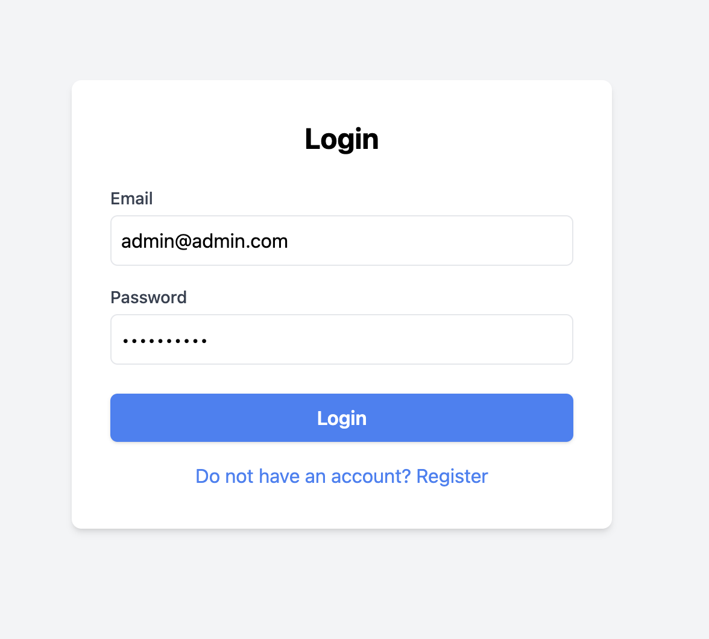
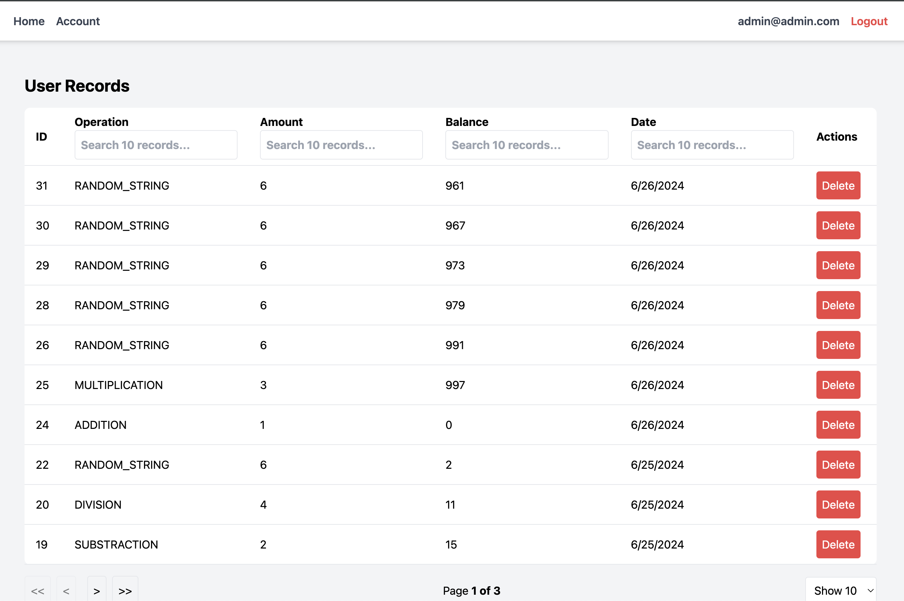
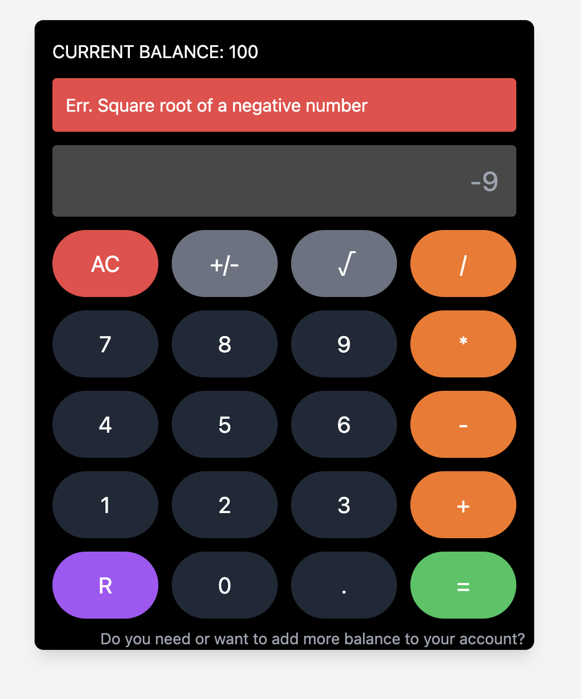

# Arithmetic Calculator REST API

This project harnesses Next.js, Tailwind CSS, and PostgreSQL to create a robust web application. By utilizing Next.js API features, it streamlines both backend and frontend development, saving significant development time.

## Live Version
The application will be deployed using Vercel's free service account, leveraging its seamless integration with Next.js.

You can view the live version of the application here: https://nextjs-arithmetic-calculator.vercel.app/

[](https://vercel.com/new/clone?repository-url=https://github.com/frcuutn/nextjs-arithmetic-calculator)

## Features

- **Next.js API Routes**: Utilized for building backend APIs, reducing development time.
- **Unit Tests**: Unit tests are included to validate the functionality of critical components, including API routes, service layers, and utility functions.
- **Pagination**: Implementing pagination for better user experience and optimized data loading.
- **PostgreSQL**: Relational database for storing application data.
- **Tailwind CSS**: Utility-first CSS framework for styling components.
- **JWT Authentication**: Used JWT-based authentication for securing API endpoints.
- **Deployment on Vercel**: Project deployment is facilitated using Vercel's free service account, ensuring seamless hosting and scaling capabilities.

## Improvements and Future Enhancements

- **State Management**: Consider integrating context or Redux for efficient state management across components.
- **OAuth Integration**: Explore integrating OAuth-based authentication for seamless user authentication via third-party providers.
- **Server Framework for AWS**: Evaluate using server frameworks like Express.js or Nest.js for backend APIs, facilitating deployment on AWS services.
- **Dependency Injection**: Evaluate using Dependency Injection (DI) to reduced coupling, enhance testability and maintainability of service layers.
- **ORM Implementation**: Use an ORM (Object-Relational Mapping) like TypeORM or Sequelize to mitigate SQL injection vulnerabilities and simplify database interactions.


## Getting Started

### Set Environment Variables

Set up PostgreSQL and configure connection details copiying `.env.local.example` file.

- `DB_HOST`: Hostname or IP address of the database server
- `DB_USER`: Database username
- `DB_PASSWORD`: Password for the database user
- `DB_NAME`: Name of the database
- `DB_PORT`: Port number on which the database server is listening
- `DB_REQUIRE_SSL`: It will only let the client access via https
- `JWT_SECRET`: Secret key used for JWT token signing and verification
- `DEFAULT_USER_BALANCE`: Default balance amount assigned to new users
- `URL_RANDOM_STR_SERVICE`: URL endpoint or service location for generating random strings

## Run using Docker Compose

Make sure you have the following components installed:

- [Docker](https://www.docker.com/get-started)
- [Docker Compose](https://docs.docker.com/compose/install/)

To start the services, use the following command:
- ```docker-compose --env-file .env.local up -d```

Rebuilding the Services:
- ```docker-compose down```
- ```docker-compose --env-file .env.local build```
- ```docker-compose --env-file .env.local up -d```

To run the project locally:

1. Clone the repository.
2. Install dependencies using `npm install`.
3. Set up PostgreSQL and configure connection details in `.env.local` file.
4. Run the application using `npm run dev`.
5. Access the application at `http://localhost:3000`.
6. Access the API at `http://localhost:3000/api/v1/`.

#### Login Screen



#### Account Screen



#### Calculator Screen


